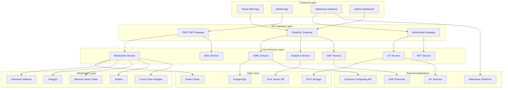

# Advanced Waste Management System Design Document

## Overview

This design document outlines the architecture for enhancing the existing Delhi Waste Management System into a revolutionary all-in-one platform that combines cutting-edge AI/ML, blockchain, Web3, and emerging technologies. The system will build upon the current foundation while introducing advanced features including NFT-based certificates, DeFi integration, autonomous processing, quantum analytics, DAO governance, metaverse integration, and cross-chain interoperability.

## Architecture

### High-Level Architecture

The system follows a microservices architecture with the following key layers:



### Enhanced AI/ML Architecture

Building upon the existing AI services, the enhanced system includes:

#### Multi-Modal Sensor Fusion
- **Visual Analysis**: Enhanced YOLO models with custom waste detection
- **Spectroscopic Analysis**: Integration with NIR/FTIR spectrometers for material identification
- **Weight/Density Analysis**: Smart scales with density calculation
- **Chemical Analysis**: Integration with portable XRF analyzers
- **Sensor Fusion Engine**: TensorFlow-based fusion model combining all sensor inputs

#### Quantum-Enhanced Analytics
- **Quantum Optimization**: Integration with IBM Quantum or Google Quantum AI for complex optimization problems
- **Quantum Machine Learning**: Hybrid classical-quantum models for pattern recognition
- **Quantum Simulation**: Digital twin simulations using quantum computing for complex system modeling

#### Autonomous Processing Control
- **Reinforcement Learning**: Deep Q-Networks for autonomous equipment control
- **Computer Vision**: Real-time monitoring of processing equipment
- **Predictive Maintenance**: LSTM models for equipment failure prediction
- **Process Optimization**: Genetic algorithms for parameter optimization

## Components and Interfaces

### 1. Enhanced AI/ML Service

```typescript
interface AIMLService {
  // Multi-modal analysis
  analyzeWasteMultiModal(
    visualData: ImageData,
    spectralData: SpectralData,
    weightData: WeightData,
    chemicalData: ChemicalData
  ): Promise<WasteAnalysisResult>;
  
  // Autonomous processing control
  controlProcessingEquipment(
    equipmentId: string,
    wasteType: string,
    parameters: ProcessingParameters
  ): Promise<ProcessingResult>;
  
  // Quantum-enhanced predictions
  quantumPredict(
    inputData: QuantumInputData,
    predictionType: PredictionType
  ): Promise<QuantumPredictionResult>;
  
  // Digital twin operations
  updateDigitalTwin(
    twinId: string,
    realTimeData: SensorData[]
  ): Promise<DigitalTwinState>;
}

interface WasteAnalysisResult {
  classification: WasteClassification;
  confidence: number;
  materialComposition: MaterialComposition[];
  contaminationLevel: number;
  processingRecommendations: ProcessingRecommendation[];
  valueEstimate: number;
  carbonFootprint: number;
}
```

### 2. NFT and Digital Twin Service

```typescript
interface NFTService {
  // NFT certificate creation
  mintWasteCertificate(
    wasteData: WasteProcessingData,
    environmentalImpact: EnvironmentalImpact
  ): Promise<NFTCertificate>;
  
  // Digital twin management
  createDigitalTwin(
    physicalAsset: PhysicalAsset,
    initialState: TwinState
  ): Promise<DigitalTwin>;
  
  // Metadata updates
  updateNFTMetadata(
    tokenId: string,
    newData: ProcessingUpdate
  ): Promise<TransactionHash>;
  
  // Certificate verification
  verifyCertificate(
    tokenId: string
  ): Promise<CertificateVerification>;
}

interface NFTCertificate {
  tokenId: string;
  wasteOrigin: WasteOrigin;
  processingMethod: ProcessingMethod;
  environmentalImpact: EnvironmentalImpact;
  carbonCredits: number;
  recyclingEfficiency: number;
  timestamp: Date;
  ipfsHash: string;
}
```

### 3. DeFi Integration Service

```typescript
interface DeFiService {
  // Carbon credit tokenization
  tokenizeCarbonCredits(
    credits: CarbonCredit[],
    verification: VerificationData
  ): Promise<TokenizedCredits>;
  
  // Staking and yield farming
  stakeEnvironmentalTokens(
    amount: number,
    stakingPool: StakingPool
  ): Promise<StakingResult>;
  
  // Liquidity provision
  provideLiquidity(
    tokenA: Token,
    tokenB: Token,
    amounts: [number, number]
  ): Promise<LiquidityPosition>;
  
  // Automated market making
  executeSwap(
    inputToken: Token,
    outputToken: Token,
    amount: number,
    slippage: number
  ): Promise<SwapResult>;
}

interface CarbonCredit {
  id: string;
  wasteSource: string;
  co2Offset: number;
  verificationStandard: string;
  issuanceDate: Date;
  expiryDate: Date;
  additionalityProof: string;
}
```

### 4. DAO Governance Service

```typescript
interface DAOService {
  // Proposal management
  createProposal(
    proposalData: ProposalData,
    proposer: Address
  ): Promise<ProposalId>;
  
  // Quadratic voting
  castQuadraticVote(
    proposalId: string,
    voter: Address,
    voteWeight: number,
    tokenAmount: number
  ): Promise<VoteResult>;
  
  // Treasury management
  executeTreasuryAction(
    action: TreasuryAction,
    signatures: MultiSigSignature[]
  ): Promise<ExecutionResult>;
  
  // Dispute resolution
  initiateArbitration(
    dispute: DisputeData,
    arbitrators: Address[]
  ): Promise<ArbitrationCase>;
}

interface ProposalData {
  title: string;
  description: string;
  proposalType: ProposalType;
  executionCode: string;
  votingPeriod: number;
  quorumThreshold: number;
  passingThreshold: number;
}
```

### 5. Metaverse Integration Service

```typescript
interface MetaverseService {
  // Virtual world integration
  createVirtualFacility(
    facilityData: FacilityData,
    metaversePlatform: MetaversePlatform
  ): Promise<VirtualFacility>;
  
  // Gamified experiences
  createWasteManagementGame(
    gameType: GameType,
    rewards: RewardStructure
  ): Promise<GameInstance>;
  
  // Virtual asset management
  mintVirtualAsset(
    assetData: VirtualAssetData,
    owner: Address
  ): Promise<VirtualAsset>;
  
  // Cross-reality synchronization
  syncRealToVirtual(
    realWorldData: RealWorldData,
    virtualWorldId: string
  ): Promise<SyncResult>;
}

interface VirtualFacility {
  facilityId: string;
  metaversePlatform: string;
  coordinates: VirtualCoordinates;
  interactiveElements: InteractiveElement[];
  educationalContent: EducationalContent[];
  gamificationFeatures: GameFeature[];
}
```

### 6. Cross-Chain Interoperability Service

```typescript
interface CrossChainService {
  // Asset bridging
  bridgeAssets(
    sourceChain: ChainId,
    targetChain: ChainId,
    asset: Asset,
    amount: number,
    recipient: Address
  ): Promise<BridgeTransaction>;
  
  // Cross-chain messaging
  sendCrossChainMessage(
    targetChain: ChainId,
    message: CrossChainMessage,
    gasLimit: number
  ): Promise<MessageResult>;
  
  // Multi-chain state synchronization
  syncStateAcrossChains(
    stateData: StateData,
    targetChains: ChainId[]
  ): Promise<SyncResult[]>;
  
  // Atomic swaps
  executeAtomicSwap(
    swapData: AtomicSwapData,
    counterparty: Address
  ): Promise<SwapResult>;
}

interface CrossChainMessage {
  messageType: MessageType;
  payload: any;
  sourceChain: ChainId;
  targetChain: ChainId;
  gasLimit: number;
  timestamp: Date;
}
```

## Data Models

### Enhanced Waste Processing Data

```typescript
interface WasteProcessingRecord {
  id: string;
  wasteId: string;
  processingStages: ProcessingStage[];
  aiAnalysis: AIAnalysisResult;
  digitalTwinId: string;
  nftCertificateId?: string;
  carbonCreditsGenerated: number;
  environmentalImpact: EnvironmentalImpact;
  blockchainRecords: BlockchainRecord[];
  qualityMetrics: QualityMetric[];
  autonomousProcessingLogs: ProcessingLog[];
  createdAt: Date;
  updatedAt: Date;
}

interface ProcessingStage {
  stageId: string;
  stageName: string;
  inputMaterials: Material[];
  outputMaterials: Material[];
  processingParameters: ProcessingParameters;
  energyConsumption: number;
  emissions: EmissionData;
  efficiency: number;
  automationLevel: AutomationLevel;
  qualityScore: number;
  timestamp: Date;
}

interface DigitalTwin {
  twinId: string;
  physicalAssetId: string;
  currentState: TwinState;
  historicalStates: TwinState[];
  predictiveModels: PredictiveModel[];
  simulationResults: SimulationResult[];
  quantumEnhancedData: QuantumData;
  realTimeSensors: SensorConnection[];
  lastUpdated: Date;
}
```

### DAO and Governance Data

```typescript
interface DAOProposal {
  proposalId: string;
  proposer: Address;
  title: string;
  description: string;
  proposalType: ProposalType;
  votingMechanism: VotingMechanism;
  votes: QuadraticVote[];
  currentStatus: ProposalStatus;
  executionCode: string;
  createdAt: Date;
  votingEndsAt: Date;
  executedAt?: Date;
  executionResult?: ExecutionResult;
}

interface QuadraticVote {
  voter: Address;
  voteWeight: number;
  tokenAmount: number;
  votingPower: number; // sqrt(tokenAmount)
  timestamp: Date;
  transactionHash: string;
}
```

### Metaverse and Virtual Assets

```typescript
interface VirtualAsset {
  assetId: string;
  owner: Address;
  assetType: VirtualAssetType;
  metaversePlatform: string;
  virtualCoordinates: VirtualCoordinates;
  realWorldConnection?: string;
  interactivityLevel: InteractivityLevel;
  educationalValue: number;
  gamificationFeatures: GameFeature[];
  nftRepresentation?: string;
  createdAt: Date;
}

interface GameSession {
  sessionId: string;
  player: Address;
  gameType: GameType;
  virtualFacilityId: string;
  tasksCompleted: GameTask[];
  tokensEarned: number;
  nftsEarned: string[];
  educationalProgress: EducationalProgress;
  realWorldImpact: RealWorldImpact;
  startTime: Date;
  endTime?: Date;
}
```

## Error Handling

### Comprehensive Error Management

```typescript
enum ErrorType {
  AI_ANALYSIS_FAILED = 'AI_ANALYSIS_FAILED',
  BLOCKCHAIN_TRANSACTION_FAILED = 'BLOCKCHAIN_TRANSACTION_FAILED',
  CROSS_CHAIN_BRIDGE_ERROR = 'CROSS_CHAIN_BRIDGE_ERROR',
  QUANTUM_COMPUTATION_ERROR = 'QUANTUM_COMPUTATION_ERROR',
  NFT_MINTING_FAILED = 'NFT_MINTING_FAILED',
  DAO_VOTING_ERROR = 'DAO_VOTING_ERROR',
  METAVERSE_SYNC_ERROR = 'METAVERSE_SYNC_ERROR',
  SENSOR_FUSION_ERROR = 'SENSOR_FUSION_ERROR',
  AUTONOMOUS_PROCESSING_ERROR = 'AUTONOMOUS_PROCESSING_ERROR',
  DIGITAL_TWIN_UPDATE_ERROR = 'DIGITAL_TWIN_UPDATE_ERROR'
}

interface ErrorHandler {
  handleAIError(error: AIError): Promise<AIErrorRecovery>;
  handleBlockchainError(error: BlockchainError): Promise<BlockchainErrorRecovery>;
  handleCrossChainError(error: CrossChainError): Promise<CrossChainErrorRecovery>;
  handleQuantumError(error: QuantumError): Promise<QuantumErrorRecovery>;
  handleMetaverseError(error: MetaverseError): Promise<MetaverseErrorRecovery>;
}
```

### Fallback Mechanisms

- **AI Analysis Fallback**: If quantum-enhanced analysis fails, fall back to classical ML models
- **Blockchain Fallback**: If primary chain fails, automatically switch to backup chain
- **Cross-Chain Fallback**: If bridge fails, queue transactions for retry with exponential backoff
- **Sensor Fallback**: If multi-modal analysis fails, use best available single sensor
- **Autonomous Processing Fallback**: If AI control fails, switch to manual override mode

## Testing Strategy

### Multi-Layer Testing Approach

#### 1. Unit Testing
- **AI/ML Models**: Test individual model accuracy and performance
- **Smart Contracts**: Comprehensive testing of all contract functions
- **Cross-Chain Logic**: Test bridge and interoperability functions
- **DAO Mechanisms**: Test voting, proposal, and execution logic

#### 2. Integration Testing
- **Multi-Modal Sensor Integration**: Test sensor fusion accuracy
- **Blockchain Integration**: Test multi-chain transaction flows
- **Metaverse Integration**: Test virtual-real world synchronization
- **DeFi Protocol Integration**: Test token swaps and liquidity provision

#### 3. End-to-End Testing
- **Complete Waste Processing Flow**: From collection to NFT certificate
- **DAO Governance Flow**: From proposal creation to execution
- **Cross-Chain Asset Transfer**: Complete bridge transaction flow
- **Metaverse Gaming Flow**: Complete virtual waste management session

#### 4. Performance Testing
- **Quantum Computing Load**: Test quantum algorithm performance under load
- **Multi-Chain Scalability**: Test system performance across multiple blockchains
- **Real-Time Processing**: Test system response times for autonomous processing
- **Metaverse Rendering**: Test virtual world performance with multiple users

#### 5. Security Testing
- **Smart Contract Audits**: Professional security audits for all contracts
- **Cross-Chain Security**: Test bridge security and attack vectors
- **DAO Security**: Test governance attack vectors and mitigation
- **AI Model Security**: Test adversarial attacks on ML models

### Testing Tools and Frameworks

- **Smart Contract Testing**: Hardhat, Truffle, Foundry
- **AI/ML Testing**: TensorFlow Testing, PyTest, MLflow
- **Cross-Chain Testing**: Custom bridge testing framework
- **Metaverse Testing**: Unity Test Framework, Unreal Engine testing tools
- **Load Testing**: Artillery, K6, custom quantum load testing
- **Security Testing**: MythX, Slither, custom security scanners

This comprehensive design provides the foundation for building a truly revolutionary waste management system that combines cutting-edge technologies in AI, blockchain, Web3, quantum computing, and metaverse integration while building upon your existing robust foundation.