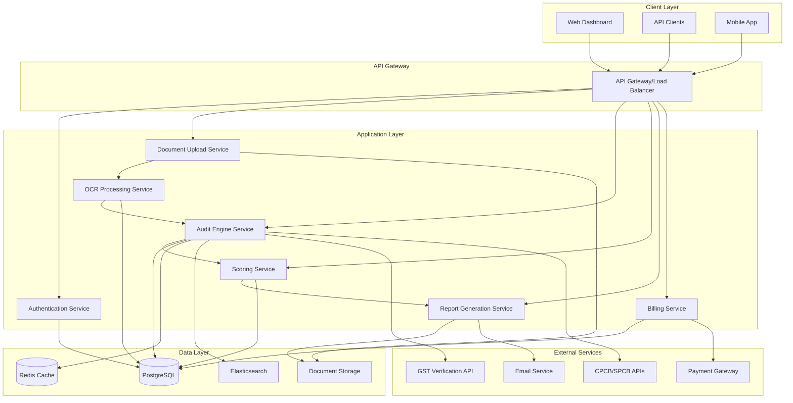

# Design Document

## Overview

The EPR Compliance System is designed as a multi-tier web application that automates Extended Producer Responsibility compliance auditing and fraud detection. The system follows a microservices architecture with clear separation between document processing, audit engine, scoring algorithms, and reporting components. The design prioritizes security, scalability, and regulatory compliance while maintaining high performance for document processing workflows.

## Architecture

### High-Level Architecture



### Technology Stack

**Backend Services:**
- **API Framework:** Node.js with Express.js for high-performance API services
- **Authentication:** JWT-based authentication with role-based access control
- **Database:** PostgreSQL for transactional data, Redis for caching and session management
- **Document Storage:** AWS S3 or compatible object storage for secure document archival
- **Search Engine:** Elasticsearch for fast document and audit log searching
- **Message Queue:** Redis/Bull for background job processing

**Frontend:**
- **Framework:** React.js with TypeScript for type safety
- **State Management:** Redux Toolkit for predictable state management
- **UI Components:** Material-UI or Ant Design for professional interface
- **File Upload:** React Dropzone for drag-and-drop document uploads

**Document Processing:**
- **OCR Engine:** Tesseract.js or Google Cloud Vision API for text extraction
- **PDF Processing:** PDF.js for client-side preview, pdf2pic for server-side processing
- **Image Processing:** Sharp.js for image optimization and preprocessing

## Components and Interfaces

### 1. Authentication Service

**Purpose:** Manages user authentication, authorization, and role-based access control.

**Key Interfaces:**
```typescript
interface AuthService {
  login(credentials: LoginCredentials): Promise<AuthResponse>
  register(clientData: ClientRegistration): Promise<ClientAccount>
  validateToken(token: string): Promise<UserSession>
  assignRole(userId: string, role: UserRole): Promise<void>
  revokeAccess(userId: string): Promise<void>
}

interface UserRole {
  id: string
  name: 'admin' | 'upload-only' | 'view-only' | 'auditor'
  permissions: Permission[]
}
```

### 2. Document Upload Service

**Purpose:** Handles secure document upload, validation, and initial processing.

**Key Interfaces:**
```typescript
interface DocumentUploadService {
  uploadDocuments(files: File[], clientId: string): Promise<UploadResponse>
  validateDocument(document: Document): Promise<ValidationResult>
  getUploadStatus(uploadId: string): Promise<UploadStatus>
  bulkUpload(files: File[], metadata: UploadMetadata): Promise<BulkUploadResponse>
}

interface Document {
  id: string
  filename: string
  contentType: string
  size: number
  uploadedAt: Date
  clientId: string
  status: 'uploaded' | 'processing' | 'processed' | 'failed'
}
```

### 3. OCR Processing Service

**Purpose:** Extracts structured data from uploaded documents using OCR technology.

**Key Interfaces:**
```typescript
interface OCRService {
  processDocument(documentId: string): Promise<OCRResult>
  extractInvoiceData(document: Document): Promise<InvoiceData>
  extractWeighbridgeData(document: Document): Promise<WeighbridgeData>
  validateExtractedData(data: ExtractedData): Promise<ValidationResult>
}

interface InvoiceData {
  invoiceNumber: string
  date: Date
  gstNumber: string
  vendorName: string
  amount: number
  items: InvoiceItem[]
}

interface WeighbridgeData {
  slipNumber: string
  date: Date
  vehicleNumber: string
  grossWeight: number
  tareWeight: number
  netWeight: number
  material: string
}
```

### 4. Audit Engine Service

**Purpose:** Core auditing logic that validates documents against master database and detects fraud.

**Key Interfaces:**
```typescript
interface AuditEngine {
  auditSubmission(submissionId: string): Promise<AuditResult>
  validateRecycler(recyclerData: RecyclerInfo): Promise<RecyclerValidation>
  detectAnomalies(data: ProcessedData[]): Promise<AnomalyReport>
  crossReferenceGST(gstNumber: string): Promise<GSTValidation>
  flagInconsistencies(documents: Document[]): Promise<InconsistencyReport>
}

interface AuditResult {
  submissionId: string
  overallStatus: 'passed' | 'failed' | 'flagged'
  findings: AuditFinding[]
  riskScore: number
  recommendations: string[]
  auditTrail: AuditTrailEntry[]
}

interface AuditFinding {
  type: 'error' | 'warning' | 'info'
  category: 'document_inconsistency' | 'vendor_validation' | 'data_anomaly'
  description: string
  documentId: string
  severity: 'high' | 'medium' | 'low'
}
```

### 5. Scoring Service

**Purpose:** Calculates ClaimClean Score based on audit results and provides actionable insights.

**Key Interfaces:**
```typescript
interface ScoringService {
  calculateScore(auditResult: AuditResult): Promise<ClaimCleanScore>
  getScoreBreakdown(scoreId: string): Promise<ScoreBreakdown>
  generateRecommendations(score: ClaimCleanScore): Promise<Recommendation[]>
  compareWithBenchmark(score: ClaimCleanScore, industry: string): Promise<BenchmarkComparison>
}

interface ClaimCleanScore {
  id: string
  overallScore: number // 0-100
  components: {
    vendorCredibility: number
    documentConsistency: number
    traceabilityScore: number
    complianceScore: number
  }
  calculatedAt: Date
  validUntil: Date
}
```

### 6. Report Generation Service

**Purpose:** Creates professional PDF reports for regulatory submission and internal use.

**Key Interfaces:**
```typescript
interface ReportService {
  generateAuditReport(submissionId: string, template: ReportTemplate): Promise<Report>
  generateScoreReport(scoreId: string): Promise<Report>
  customizeReport(reportId: string, customization: ReportCustomization): Promise<Report>
  scheduleReport(schedule: ReportSchedule): Promise<ScheduledReport>
}

interface Report {
  id: string
  type: 'audit' | 'score' | 'compliance'
  format: 'pdf' | 'excel'
  generatedAt: Date
  downloadUrl: string
  expiresAt: Date
}
```

## Data Models

### Core Entities

```typescript
// Client and User Management
interface Client {
  id: string
  companyName: string
  industry: string
  subscriptionTier: 'basic' | 'professional' | 'enterprise'
  billingInfo: BillingInfo
  createdAt: Date
  isActive: boolean
}

interface User {
  id: string
  clientId: string
  email: string
  role: UserRole
  lastLoginAt: Date
  isActive: boolean
}

// Document Management
interface DocumentSubmission {
  id: string
  clientId: string
  submittedAt: Date
  status: 'processing' | 'completed' | 'failed'
  documents: Document[]
  auditResult?: AuditResult
  score?: ClaimCleanScore
}

// Master Data
interface RecyclerMaster {
  id: string
  name: string
  gstNumber: string
  cpcbId: string
  spcbId: string
  address: Address
  certifications: Certification[]
  riskProfile: 'low' | 'medium' | 'high'
  lastVerified: Date
  isActive: boolean
}

// Audit and Scoring
interface AuditTrailEntry {
  id: string
  submissionId: string
  action: string
  performedBy: string
  performedAt: Date
  details: Record<string, any>
  ipAddress: string
}
```

### Database Schema Design

**Key Tables:**
- `clients` - Client account information
- `users` - User accounts with role-based access
- `document_submissions` - Batch submissions from clients
- `documents` - Individual document records
- `ocr_results` - Extracted data from documents
- `audit_results` - Audit findings and results
- `claim_clean_scores` - Calculated scores and breakdowns
- `recycler_master` - Master database of verified recyclers
- `audit_trail` - Complete audit log of all system actions
- `reports` - Generated reports and their metadata
- `billing_records` - Subscription and usage billing data

## Error Handling

### Error Categories and Responses

**1. Document Processing Errors**
- OCR failures due to poor image quality
- Unsupported file formats
- File size limitations exceeded
- Corrupted or encrypted documents

**2. Validation Errors**
- Invalid GST numbers
- Unregistered recyclers
- Date inconsistencies
- Missing required fields

**3. System Errors**
- Database connection failures
- External API timeouts
- Storage service unavailability
- Authentication service failures

**4. Business Logic Errors**
- Audit rule violations
- Score calculation failures
- Report generation errors
- Billing processing issues

### Error Handling Strategy

```typescript
interface ErrorResponse {
  error: {
    code: string
    message: string
    details?: Record<string, any>
    timestamp: Date
    requestId: string
  }
}

// Centralized error handling middleware
class ErrorHandler {
  static handleDocumentError(error: DocumentError): ErrorResponse
  static handleValidationError(error: ValidationError): ErrorResponse
  static handleSystemError(error: SystemError): ErrorResponse
  static logError(error: Error, context: RequestContext): void
}
```

## Testing Strategy

### Testing Pyramid

**1. Unit Tests (70%)**
- Individual service methods
- Data validation functions
- Scoring algorithms
- OCR processing logic
- Business rule validation

**2. Integration Tests (20%)**
- API endpoint testing
- Database operations
- External service integrations
- Document processing workflows
- Authentication flows

**3. End-to-End Tests (10%)**
- Complete user workflows
- Document upload to report generation
- Multi-user scenarios
- Performance under load
- Security penetration testing

### Test Data Management

**Mock Data Sets:**
- Sample invoices and weighbridge slips
- Known good and fraudulent documents
- Recycler master data variations
- Edge cases and error conditions

**Test Environments:**
- Development: Full feature testing
- Staging: Production-like environment
- Performance: Load and stress testing
- Security: Penetration testing environment

### Automated Testing Pipeline

```yaml
# CI/CD Pipeline Testing Stages
stages:
  - lint_and_format
  - unit_tests
  - integration_tests
  - security_scan
  - performance_tests
  - e2e_tests
  - deployment_tests
```

## Security Considerations

### Data Protection
- End-to-end encryption for document uploads
- AES-256 encryption for data at rest
- TLS 1.3 for data in transit
- Regular security audits and penetration testing

### Access Control
- Multi-factor authentication for admin users
- Role-based permissions with principle of least privilege
- API rate limiting and request throttling
- Session management with secure token handling

### Compliance
- GDPR compliance for data privacy
- SOC 2 Type II certification readiness
- Regular compliance audits
- Data retention and deletion policies

### Audit Logging
- Complete audit trail of all user actions
- Immutable log storage
- Real-time security monitoring
- Automated threat detection and response