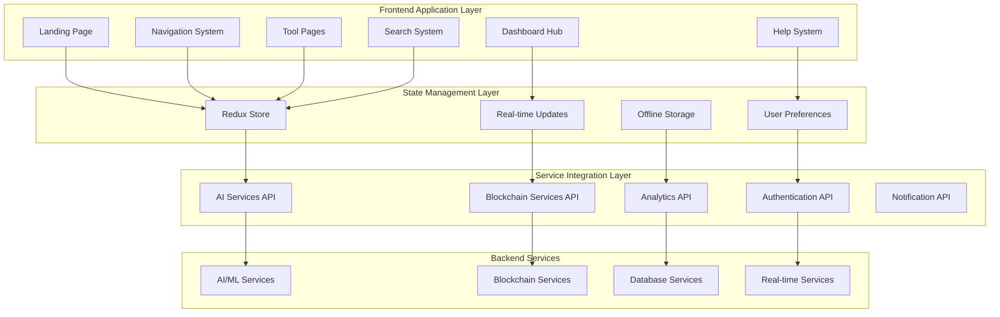
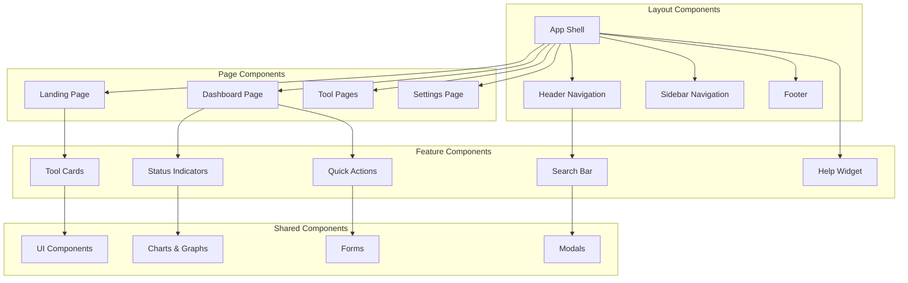

# User Interface and Landing Page Design Document

## Overview

This design document outlines the architecture for creating a comprehensive user interface and landing page system for the Advanced Waste Management System. The design will create a modern, intuitive interface that serves as the central hub for accessing all waste management tools including AI-powered analysis, contamination detection, blockchain certificates, digital twins, analytics, and more. The system will follow modern web design principles with responsive layouts, progressive web app capabilities, and seamless integration with existing backend services.

## Architecture

### High-Level Architecture

The user interface follows a modern React-based single-page application (SPA) architecture with the following layers:



### Component Architecture

The frontend application is structured using a modular component architecture:



## Components and Interfaces

### 1. Landing Page Component

```typescript
interface LandingPageProps {
  systemStats: SystemStatistics;
  toolCategories: ToolCategory[];
  recentActivity: ActivityItem[];
  userRole: UserRole;
}

interface LandingPageComponent {
  // Hero section with system overview
  renderHeroSection(): JSX.Element;
  
  // Tool categories showcase
  renderToolCategories(categories: ToolCategory[]): JSX.Element;
  
  // System statistics display
  renderSystemStats(stats: SystemStatistics): JSX.Element;
  
  // Recent activity feed
  renderActivityFeed(activities: ActivityItem[]): JSX.Element;
  
  // Quick start guide
  renderQuickStart(): JSX.Element;
}

interface SystemStatistics {
  wasteProcessedToday: number;
  systemEfficiency: number;
  contaminationRate: number;
  carbonCreditsGenerated: number;
  activeUsers: number;
  systemUptime: number;
}

interface ToolCategory {
  id: string;
  name: string;
  description: string;
  icon: string;
  status: 'active' | 'warning' | 'error' | 'maintenance';
  tools: Tool[];
  quickActions: QuickAction[];
}
```

### 2. Navigation System

```typescript
interface NavigationProps {
  currentPath: string;
  userPermissions: Permission[];
  notifications: Notification[];
}

interface NavigationComponent {
  // Main navigation menu
  renderMainNavigation(): JSX.Element;
  
  // Breadcrumb navigation
  renderBreadcrumbs(path: string): JSX.Element;
  
  // User menu and profile
  renderUserMenu(): JSX.Element;
  
  // Notification center
  renderNotifications(notifications: Notification[]): JSX.Element;
  
  // Mobile navigation
  renderMobileNavigation(): JSX.Element;
}

interface NavigationItem {
  id: string;
  label: string;
  path: string;
  icon: string;
  children?: NavigationItem[];
  requiredPermission?: Permission;
  badge?: BadgeInfo;
}

interface BadgeInfo {
  count: number;
  type: 'info' | 'warning' | 'error' | 'success';
}
```

### 3. Dashboard Hub Component

```typescript
interface DashboardProps {
  widgets: DashboardWidget[];
  layout: LayoutConfiguration;
  realTimeData: RealTimeData;
}

interface DashboardComponent {
  // Widget grid layout
  renderWidgetGrid(widgets: DashboardWidget[]): JSX.Element;
  
  // Real-time status indicators
  renderStatusIndicators(data: RealTimeData): JSX.Element;
  
  // Quick action center
  renderQuickActions(): JSX.Element;
  
  // Customization controls
  renderCustomizationPanel(): JSX.Element;
  
  // Alert and notification panel
  renderAlertPanel(): JSX.Element;
}

interface DashboardWidget {
  id: string;
  type: WidgetType;
  title: string;
  size: WidgetSize;
  position: WidgetPosition;
  data: any;
  refreshInterval?: number;
  permissions?: Permission[];
}

enum WidgetType {
  STATUS_CARD = 'status_card',
  CHART = 'chart',
  TABLE = 'table',
  QUICK_ACTIONS = 'quick_actions',
  ACTIVITY_FEED = 'activity_feed',
  ALERTS = 'alerts'
}
```

### 4. Tool Integration Components

```typescript
interface ToolPageProps {
  toolId: string;
  toolConfig: ToolConfiguration;
  userData: UserData;
}

interface ToolPageComponent {
  // Tool-specific interface
  renderToolInterface(config: ToolConfiguration): JSX.Element;
  
  // Tool status and controls
  renderToolControls(): JSX.Element;
  
  // Data visualization
  renderDataVisualization(data: any): JSX.Element;
  
  // Export and sharing options
  renderExportOptions(): JSX.Element;
  
  // Help and documentation
  renderToolHelp(): JSX.Element;
}

interface ToolConfiguration {
  id: string;
  name: string;
  description: string;
  apiEndpoint: string;
  uiComponent: string;
  permissions: Permission[];
  settings: ToolSettings;
  helpDocumentation: string;
}

// Specific tool integrations
interface WasteAnalysisToolProps {
  sensorData: SensorData[];
  analysisResults: AnalysisResult[];
  realTimeMonitoring: boolean;
}

interface ContaminationDetectionProps {
  flaggedBatches: FlaggedBatch[];
  remediationSuggestions: RemediationSuggestion[];
  visualizationData: VisualizationData;
}

interface BlockchainCertificateProps {
  certificates: Certificate[];
  digitalTwins: DigitalTwin[];
  transactionHistory: Transaction[];
}
```

### 5. Search and Discovery System

```typescript
interface SearchProps {
  searchQuery: string;
  searchResults: SearchResult[];
  searchFilters: SearchFilter[];
}

interface SearchComponent {
  // Global search interface
  renderSearchBar(): JSX.Element;
  
  // Search results display
  renderSearchResults(results: SearchResult[]): JSX.Element;
  
  // Search filters and facets
  renderSearchFilters(filters: SearchFilter[]): JSX.Element;
  
  // Search suggestions
  renderSearchSuggestions(): JSX.Element;
  
  // Advanced search options
  renderAdvancedSearch(): JSX.Element;
}

interface SearchResult {
  id: string;
  type: SearchResultType;
  title: string;
  description: string;
  url: string;
  relevanceScore: number;
  category: string;
  lastUpdated: Date;
  preview?: any;
}

enum SearchResultType {
  TOOL = 'tool',
  DATA_RECORD = 'data_record',
  DOCUMENTATION = 'documentation',
  USER = 'user',
  REPORT = 'report'
}
```

### 6. Progressive Web App Features

```typescript
interface PWAService {
  // Service worker management
  registerServiceWorker(): Promise<ServiceWorkerRegistration>;
  
  // Offline data management
  cacheEssentialData(): Promise<void>;
  syncOfflineData(): Promise<SyncResult>;
  
  // Push notifications
  requestNotificationPermission(): Promise<NotificationPermission>;
  sendPushNotification(notification: PushNotification): Promise<void>;
  
  // App installation
  promptAppInstall(): Promise<InstallPromptResult>;
  
  // Background sync
  scheduleBackgroundSync(data: SyncData): Promise<void>;
}

interface OfflineCapabilities {
  // Cached data access
  getCachedData(key: string): Promise<any>;
  setCachedData(key: string, data: any): Promise<void>;
  
  // Offline form handling
  queueOfflineAction(action: OfflineAction): Promise<void>;
  processOfflineQueue(): Promise<ProcessResult[]>;
  
  // Conflict resolution
  resolveDataConflicts(conflicts: DataConflict[]): Promise<Resolution[]>;
}
```

## Data Models

### User Interface State Management

```typescript
interface UIState {
  // Navigation state
  navigation: NavigationState;
  
  // Dashboard configuration
  dashboard: DashboardState;
  
  // Tool states
  tools: ToolStates;
  
  // User preferences
  preferences: UserPreferences;
  
  // Real-time data
  realTimeData: RealTimeState;
}

interface NavigationState {
  currentPath: string;
  breadcrumbs: BreadcrumbItem[];
  sidebarOpen: boolean;
  mobileMenuOpen: boolean;
  activeSubmenu?: string;
}

interface DashboardState {
  widgets: DashboardWidget[];
  layout: LayoutConfiguration;
  customizations: DashboardCustomization[];
  filters: DashboardFilter[];
  timeRange: TimeRange;
}

interface UserPreferences {
  theme: 'light' | 'dark' | 'auto';
  language: string;
  timezone: string;
  notifications: NotificationPreferences;
  dashboardLayout: LayoutPreferences;
  quickActions: QuickActionPreferences[];
}
```

### Tool Integration Data Models

```typescript
interface ToolState {
  id: string;
  status: ToolStatus;
  data: any;
  loading: boolean;
  error?: Error;
  lastUpdated: Date;
  configuration: ToolConfiguration;
}

interface ToolStatus {
  operational: boolean;
  health: 'healthy' | 'warning' | 'error';
  performance: PerformanceMetrics;
  alerts: Alert[];
  uptime: number;
}

interface PerformanceMetrics {
  responseTime: number;
  throughput: number;
  errorRate: number;
  resourceUsage: ResourceUsage;
}

// Specific tool data models
interface WasteAnalysisData {
  currentAnalysis: AnalysisSession[];
  historicalData: AnalysisHistory[];
  sensorReadings: SensorReading[];
  calibrationStatus: CalibrationStatus[];
}

interface ContaminationData {
  flaggedBatches: FlaggedBatch[];
  contaminationStats: ContaminationStatistics;
  remediationActions: RemediationAction[];
  visualizations: ContaminationVisualization[];
}

interface BlockchainData {
  certificates: WasteCertificate[];
  digitalTwins: DigitalTwinData[];
  transactions: BlockchainTransaction[];
  walletInfo: WalletInformation;
}
```

## Error Handling

### Comprehensive Error Management System

```typescript
enum UIErrorType {
  NETWORK_ERROR = 'NETWORK_ERROR',
  AUTHENTICATION_ERROR = 'AUTHENTICATION_ERROR',
  PERMISSION_ERROR = 'PERMISSION_ERROR',
  DATA_LOADING_ERROR = 'DATA_LOADING_ERROR',
  TOOL_INTEGRATION_ERROR = 'TOOL_INTEGRATION_ERROR',
  OFFLINE_ERROR = 'OFFLINE_ERROR',
  VALIDATION_ERROR = 'VALIDATION_ERROR'
}

interface ErrorHandler {
  // Global error handling
  handleGlobalError(error: Error, context: ErrorContext): Promise<ErrorResolution>;
  
  // Network error handling
  handleNetworkError(error: NetworkError): Promise<NetworkErrorResolution>;
  
  // Tool-specific error handling
  handleToolError(toolId: string, error: ToolError): Promise<ToolErrorResolution>;
  
  // User-friendly error display
  displayUserError(error: UserError): void;
  
  // Error recovery mechanisms
  attemptErrorRecovery(error: RecoverableError): Promise<RecoveryResult>;
}

interface ErrorBoundary {
  // Component error boundaries
  componentDidCatch(error: Error, errorInfo: ErrorInfo): void;
  
  // Fallback UI rendering
  renderErrorFallback(error: Error): JSX.Element;
  
  // Error reporting
  reportError(error: Error, context: ErrorContext): Promise<void>;
}
```

### Fallback Mechanisms

- **Network Fallback**: Offline mode with cached data when network is unavailable
- **Tool Fallback**: Alternative interfaces when specific tools are unavailable
- **Data Fallback**: Cached or default data when real-time data is unavailable
- **UI Fallback**: Simplified interfaces for low-performance devices
- **Authentication Fallback**: Guest mode with limited functionality

## Testing Strategy

### Multi-Layer Testing Approach

#### 1. Component Testing
- **Unit Tests**: Test individual React components in isolation
- **Integration Tests**: Test component interactions and data flow
- **Visual Regression Tests**: Ensure UI consistency across changes
- **Accessibility Tests**: Verify WCAG compliance and screen reader compatibility

#### 2. User Experience Testing
- **Usability Testing**: Test user workflows and task completion
- **Performance Testing**: Test loading times and responsiveness
- **Mobile Testing**: Test responsive design and touch interactions
- **Cross-Browser Testing**: Ensure compatibility across browsers

#### 3. Integration Testing
- **API Integration**: Test frontend-backend communication
- **Tool Integration**: Test integration with existing waste management tools
- **Real-Time Updates**: Test WebSocket connections and live data
- **Offline Functionality**: Test PWA features and offline capabilities

#### 4. End-to-End Testing
- **User Journey Testing**: Complete workflows from landing to task completion
- **Multi-Tool Workflows**: Test navigation between different tools
- **Search and Discovery**: Test search functionality across all content
- **Help and Onboarding**: Test user guidance and documentation systems

### Testing Tools and Frameworks

- **Component Testing**: Jest, React Testing Library, Storybook
- **E2E Testing**: Cypress, Playwright
- **Visual Testing**: Chromatic, Percy
- **Performance Testing**: Lighthouse, WebPageTest
- **Accessibility Testing**: axe-core, WAVE
- **Mobile Testing**: BrowserStack, Device Labs

## Design System and UI Guidelines

### Visual Design Principles

- **Modern and Clean**: Minimalist design with focus on functionality
- **Consistent Branding**: Cohesive color scheme and typography
- **Accessibility First**: High contrast, keyboard navigation, screen reader support
- **Responsive Design**: Mobile-first approach with progressive enhancement
- **Dark Mode Support**: Toggle between light and dark themes

### Component Library

```typescript
interface DesignSystem {
  // Color palette
  colors: ColorPalette;
  
  // Typography system
  typography: TypographySystem;
  
  // Spacing and layout
  spacing: SpacingSystem;
  
  // Component styles
  components: ComponentStyles;
  
  // Animation and transitions
  animations: AnimationSystem;
}

interface ColorPalette {
  primary: string;
  secondary: string;
  success: string;
  warning: string;
  error: string;
  neutral: string[];
  background: string[];
  text: string[];
}
```

This comprehensive design provides the foundation for creating a modern, intuitive user interface that serves as the central hub for all waste management tools while maintaining excellent user experience and technical performance.