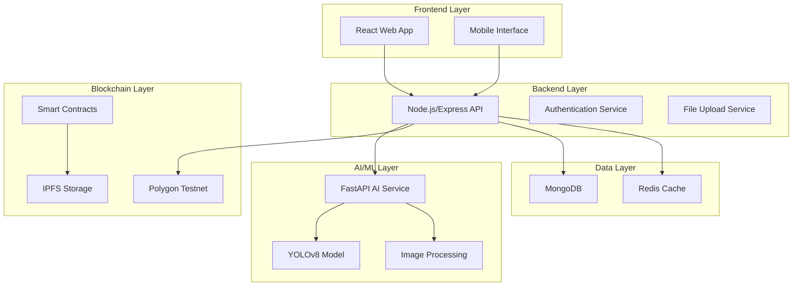

# Design Document

## Overview

The Waste Verification MVP is a full-stack application that combines computer vision AI, blockchain technology, and modern web development to create a tamper-proof waste verification system. The system follows a microservices architecture with clear separation between the frontend interface, backend API, AI processing service, and blockchain integration.

## Architecture



## Components and Interfaces

### Frontend Components

**Technology Stack:** React 18 + TypeScript + Tailwind CSS + Vite

#### Core Components:
- **WasteUploadForm**: Handles image capture, GPS location, and batch submission
- **MarketplaceListing**: Displays verified waste credits with filtering capabilities
- **AdminDashboard**: Management interface for reviewing submissions and system metrics
- **QRCodeGenerator**: Creates unique QR codes for waste batches
- **VerificationBadge**: Shows blockchain verification status and links

#### Key Interfaces:
```typescript
interface WasteSubmission {
  id: string;
  vendorId: string;
  beforeImage: File;
  afterImage: File;
  location: GeoLocation;
  timestamp: Date;
  qrCode: string;
  status: 'pending' | 'verified' | 'rejected';
}

interface WasteCredit {
  id: string;
  wasteType: 'plastic' | 'other';
  quantity: number;
  vendorId: string;
  verificationScore: number;
  blockchainTxHash: string;
  pricePerCredit: number;
}
```

### Backend API Service

**Technology Stack:** Node.js + Express + MongoDB + Redis

#### Core Modules:
- **Upload Controller**: Handles file uploads with validation and storage
- **Verification Controller**: Coordinates AI processing and blockchain recording
- **Marketplace Controller**: Manages credit listings and queries
- **Admin Controller**: Provides administrative functions and metrics
- **Blockchain Service**: Interfaces with Polygon network and smart contracts

#### API Endpoints:
```
POST /api/waste/submit - Submit waste collection proof
GET /api/waste/submissions - List submissions (admin)
PUT /api/waste/verify/:id - Approve/reject submission (admin)
GET /api/marketplace/credits - List available credits
GET /api/admin/metrics - System statistics
POST /api/blockchain/verify - Verify blockchain records
```

### AI Processing Service

**Technology Stack:** Python + FastAPI + YOLOv8 + OpenCV

#### Core Functions:
- **Waste Classification**: Identifies plastic vs non-plastic materials using pre-trained YOLOv8
- **Quantity Estimation**: Estimates weight based on visual analysis and object detection
- **Anomaly Detection**: Flags suspicious submissions using pattern recognition
- **Confidence Scoring**: Provides reliability metrics for each verification

#### AI Service Interface:
```python
class WasteVerificationService:
    def classify_waste_type(self, image: bytes) -> WasteClassification
    def estimate_quantity(self, before_image: bytes, after_image: bytes) -> QuantityEstimate
    def detect_anomalies(self, submission: WasteSubmission) -> AnomalyReport
    def calculate_confidence(self, results: VerificationResults) -> float
```

### Blockchain Integration

**Technology Stack:** Polygon Testnet + Solidity + Alchemy SDK + IPFS

#### Smart Contract Design:
```solidity
contract WasteVerificationRegistry {
    struct WasteRecord {
        string wasteType;
        uint256 quantity;
        address vendor;
        uint256 timestamp;
        string locationHash;
        string imageHash;
        bool verified;
    }
    
    mapping(bytes32 => WasteRecord) public wasteRecords;
    
    function recordWasteSubmission(
        bytes32 recordId,
        string memory wasteType,
        uint256 quantity,
        string memory locationHash,
        string memory imageHash
    ) external;
    
    function verifyRecord(bytes32 recordId) external;
}
```

## Data Models

### MongoDB Collections

#### Users Collection:
```javascript
{
  _id: ObjectId,
  email: String,
  role: 'vendor' | 'buyer' | 'admin',
  profile: {
    name: String,
    organization: String,
    walletAddress: String
  },
  createdAt: Date,
  updatedAt: Date
}
```

#### WasteSubmissions Collection:
```javascript
{
  _id: ObjectId,
  vendorId: ObjectId,
  batchId: String,
  qrCode: String,
  images: {
    before: String, // IPFS hash
    after: String   // IPFS hash
  },
  location: {
    latitude: Number,
    longitude: Number,
    address: String
  },
  aiVerification: {
    wasteType: String,
    quantity: Number,
    confidence: Number,
    anomalies: [String]
  },
  blockchainTx: String,
  status: String,
  createdAt: Date,
  processedAt: Date
}
```

#### WasteCredits Collection:
```javascript
{
  _id: ObjectId,
  submissionId: ObjectId,
  wasteType: String,
  quantity: Number,
  vendorId: ObjectId,
  pricePerCredit: Number,
  available: Boolean,
  blockchainTx: String,
  createdAt: Date
}
```

## Error Handling

### Frontend Error Handling:
- **Network Errors**: Retry mechanism with exponential backoff
- **File Upload Errors**: Clear error messages and upload progress indicators
- **Camera Access**: Fallback to file selection if camera unavailable
- **Offline Support**: Basic offline functionality with service workers

### Backend Error Handling:
- **AI Service Failures**: Fallback to manual review queue
- **Blockchain Failures**: Retry mechanism with transaction monitoring
- **Database Errors**: Connection pooling and automatic reconnection
- **File Storage Errors**: Multiple storage provider fallbacks

### AI Service Error Handling:
- **Model Loading Failures**: Health checks and automatic model reloading
- **Image Processing Errors**: Input validation and format conversion
- **Memory Management**: Batch processing limits and cleanup routines

## Testing Strategy

### Unit Testing:
- **Frontend**: Jest + React Testing Library for component testing
- **Backend**: Mocha + Chai for API endpoint testing
- **AI Service**: pytest for ML model validation
- **Smart Contracts**: Hardhat for Solidity contract testing

### Integration Testing:
- **API Integration**: End-to-end API workflow testing
- **Blockchain Integration**: Testnet deployment and transaction verification
- **AI Pipeline**: Complete image processing workflow validation

### Performance Testing:
- **Load Testing**: Concurrent user simulation for API endpoints
- **AI Performance**: Image processing speed and accuracy benchmarks
- **Blockchain Performance**: Transaction throughput and gas optimization

### Security Testing:
- **Input Validation**: File upload security and sanitization
- **Authentication**: JWT token validation and session management
- **Smart Contract Security**: Reentrancy and overflow protection

## Deployment Architecture

### Development Environment:
- **Frontend**: Vite dev server with hot reload
- **Backend**: Node.js with nodemon for auto-restart
- **AI Service**: FastAPI with uvicorn development server
- **Database**: Local MongoDB and Redis instances

### Production Environment:
- **Frontend**: Vercel deployment with CDN
- **Backend**: Railway/Render with auto-scaling
- **AI Service**: Docker container on cloud platform
- **Database**: MongoDB Atlas with Redis Cloud
- **Blockchain**: Polygon mainnet (after testnet validation)

## Security Considerations

### Data Protection:
- **Image Storage**: IPFS for decentralized storage with encryption
- **Personal Data**: GDPR compliance with data minimization
- **API Security**: Rate limiting and input validation
- **Blockchain Privacy**: Hash-based location and image references

### Authentication & Authorization:
- **JWT Tokens**: Secure token-based authentication
- **Role-Based Access**: Vendor, buyer, and admin permission levels
- **Wallet Integration**: MetaMask integration for blockchain identity

### Smart Contract Security:
- **Access Control**: Owner-only functions for critical operations
- **Input Validation**: Parameter validation and bounds checking
- **Upgrade Patterns**: Proxy contracts for future improvements